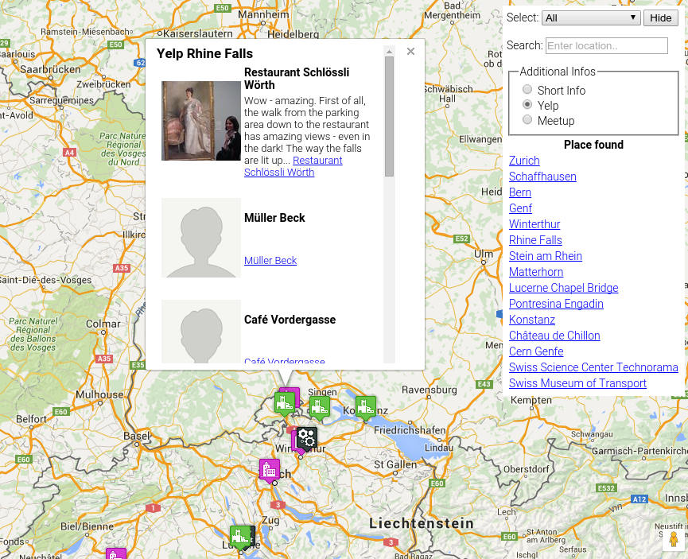
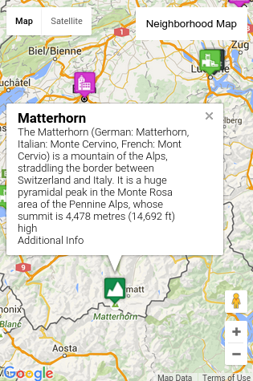
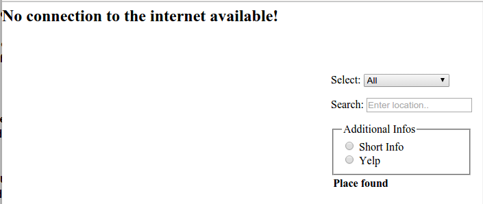

# Udacity Frontend Nanodegree Neighborhood Map Project

## Introduction

Develop a single page application using Knockoutjs and the MVVM pattern. The application should feature a map marked
with places to visit. The implementation should use Google's map API and support searching within the places to visit.
Places found should be emphasized on the map. Additional information about a place should be retrieved by means
of some third party API like Wikipedia or Yelp and displayed on demand.

### The application

Try the application [Neighborhood Map](http://akuepfer.github.io/P5-neighborhood-map-project/src/index.html) at gihub gh-pages.


## Implementation

The implementation is following the M-V-VM pattern. Files are named accordingly except for the view. The view
is implemented by the two files index.html and styles.css. The file name of the MVVM model is model.js and the view model's
file name is view-model.js.


Files of the implementation

* gulpfile.js                         - to build a minfied version in the dist directory.
* src/index.html                      - View, layout of the application
* src/styles/style.css                - Styling of the view
* src/js/view-model.js                - ViewModel
* src/js/model.js                     - Model of the application
* src/js/places-list.js               - List of predefined places to display on the map
* src/js/yelp-search.js               - Function to query yelp
* src/js/meetup-search.js             - Function to query Meetup
* src/images/placeholder-100x100.png  - Image is inserted into yelp messages where yelp doesn't deliver an image url.
* src/connect-error.png               - Image is inserted in yelp error messages
* dist/                               - minfied version generated by running `gulp build`

### Implementation Details

* On startup all the locations are listed.
* Locations may be selected by a keyword or by entering a search string.
* There are different pin icons for different types of locations.



* Clicking on a pin or a search list entry opens a window.
* The type of the window content, either an info, a list from Yelp or from Meetup. This can be selected under 'Additional Info'.

### Mobile Devices

On devices with a small screen only the button **Neighborhood Map** will be displayed. The search input will fade in
by click on the button and fade out by click on an entry on the search list or by clicking the Hide button.



### Connect Error handling

If there is no connection to the internet the message 'No connection to the Internet available!' will be displayed.




If the retrieval of data from yelp fails, the 'text status' and 'error thrown' messages return from the jQuery ajax call will
be displayed on the popup window.


In this example jQuery ajax returns for both messages the text 'timeout'.

## Checkout and run server

The application can be run using `gulp serve` and connect on localhost port 3010 or by opening the `src/index.html` file.
To run the application with gulp; npm and all required packages must be installed. The packages can be installed
by running `gulpfile-install`.

```shell
git clone https://github.com/akuepfer/P5-neighborhood-map-project.git

cd P5-neighborhood-map-project
npm install -g gulp
npm install -g gulpfile-install

gulpfile-install
gulp serve
```

## Inital project setup

Create the `P5-neighborhood-map-project` directory and install the required gulp modules

```shell
cd P5-neighborhood-map-project

npm install -g gulp

npm init
npm install gulp --save-dev

npm install browserify vinyl-source-stream --save-dev
npm install express --save-dev
npm install browser-sync --save-dev

npm install --save-dev gulp-usemin
npm install --save-dev gulp-minify-css
npm install --save-dev gulp-rev
npm install --save-dev gulp-minify
npm install --save-dev gulp-minify-html
```


## Push changes to new git reop

```shell
echo "dist" > .gitignore
echo "node_modules  >> .gitignore
echo ".idea" >> .gitignore

git init
git add .
git commit -m "initial commit" .
git remote add origin https://github.com/akuepfer/P5-neighborhood-map-project.git
git push -u origin master
```


## References

* [Knockout Documentation](http://knockoutjs.com/documentation/introduction.html)

* [Knockout Tutorial - Part 1](http://www.codeproject.com/Articles/636789/Knockout-Tutorial-Part)

* [jQuery.ajax()](http://api.jquery.com/jquery.ajax/)

* [Understanding MVVM – A Guide For JavaScript Developers, Addy Osmani](http://addyosmani.com/blog/understanding-mvvm-a-guide-for-javascript-developers/)

* [Yelp For Developers, API 2.0: Overview](https://www.yelp.co.uk/developers/documentation/v2/overview)

* [Yelp Search Sample, Lev Brie](https://github.com/levbrie/mighty_marks/blob/master/yelp-search-sample.html)

* [Meetup REST API OpenEvents](http://www.meetup.com/meetup_api/docs/2/open_events/)
